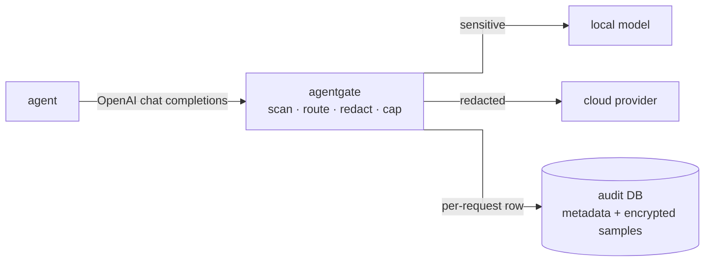

# agentgate

A transparent reverse-proxy **safety gateway** for LLM agents. Point an agent's
OpenAI-compatible `base_url` (Chat Completions) at it to enforce that every model
call is inspected and governed at one choke point:

- **Prompt-injection / tool-output scanning** of the untrusted channel (tool and
  retrieval output), so an injected instruction is caught before it reaches the model.
  Default scanner is a fine-tuned DeBERTa classifier; an optional local-LLM guard evaluates
  each trailing tool output as a separate prompt.
- **Sensitivity-aware routing** — content the classifier marks sensitive is routed to an
  on-device model, so it never leaves the host.
- **Outbound secret redaction** on cloud egress.
- **Egress policy (PDP/PEP)** — a decision endpoint the agent's gated egress tool consults
  before any outbound request, so policy is enforced off the model wire.
- **Queryable audit log** with one metadata row per handled request; selected inbound
  content is redacted, encrypted, and retained for a limited time.

Responses are streamed rather than buffered. With the heuristic guard, the measured
gateway overhead is about 1 ms at p95; model-backed guards add their own scan latency.



*Responses stream back along the same path. Not drawn: block responses (4xx/5xx),
`/metrics`, and the egress PDP/PEP — the bullets above cover them.*

This is a public extract of a larger private project. The write-up explains the design and
what it can and can't guarantee: **[docs/index.md](docs/index.md)**.

> The eval corpus is full of secret-shaped strings (`sk-…`, `AKIA…`, base64 blobs) **on
> purpose** — synthetic fixtures for the redaction tests, never real credentials. One file
> is different: `eval/redteam/corpus/fp_capture.frozen.jsonl` is real benign traffic captured
> from single-user use (agent prompts + public web/tool content), kept real so the
> false-positive rate is measured against a realistic distribution; personal identifiers in
> it (handles, emails) have been anonymized.

## Quickstart (dev)

```bash
uv sync                   # install dependencies
export AGENTGATE_ADMIN_TOKEN=$(python3 -c "import secrets; print(secrets.token_urlsafe(32))")
export AGENTGATE_PDP_TOKEN=$(python3 -c "import secrets; print(secrets.token_urlsafe(32))")
uv run agentgate          # serves on http://127.0.0.1:4100
```

The two tokens are **required** — the gateway refuses to start without them, because the
admin plane (`/admin/kill/*`) and the egress PDP are state-changing and loopback does not
exclude browser-borne requests. They must be distinct values; `.env.example` explains why
and is the persistent alternative to exporting them.

Point your agent or client at `http://127.0.0.1:4100` as its OpenAI-compatible `base_url`.

## Try it in 90 seconds

No API keys, no model downloads:

```bash
bash scripts/demo.sh
```

In a terminal the demo pauses after each step so you can read the output — press Enter to
advance, or set `DEMO_PAUSE=0` to run straight through.

The script starts the canned mock upstream (`bench/mock_upstream.py`) and an isolated
gateway on a throwaway port and database, then shows four things: a benign request
streaming through; a poisoned `role:"tool"` message rejected with HTTP 400
(`injection_blocked`); the egress PDP denying a fake AWS key headed for a
non-allowlisted host; and `agentgate audit tail` listing all of it with verdicts.
The upstream is canned — but the verdicts are the real gateway code and don't depend
on any model.

## Using it with an agent or coding harness

agentgate speaks the OpenAI Chat Completions API, so you integrate it by pointing your
tool's model base URL at the gateway. The two modes differ only in how much of the
gateway they exercise.

### 1. Behind an agent framework (e.g. [OpenClaw](https://github.com/openclaw/openclaw))

Set the agent's model-provider base URL to the gateway. Every model call is then scanned
(untrusted-channel injection), routed (sensitive content stays local), redacted (cloud
egress), and audited.

- In your provider config, set the base URL to `http://127.0.0.1:4100`.
- Optional: use the tagged route `http://127.0.0.1:4100/a/<agent_id>` so the gateway
  attributes each agent's traffic (per-agent audit, plus the router's agent-pin rules).

### 2. Inside a coding harness (e.g. [Continue](https://continue.dev))

Same model-wire integration — set your model's `apiBase` to `http://127.0.0.1:4100` —
plus the outbound-egress layer (the PDP/PEP tier):

- Run the gated egress tool as the harness's **only** network path:

  ```bash
  uv run --extra egress-mcp python -m agentgate.egress.mcp_server
  ```

- Register it as an MCP tool, and exclude the harness's built-in fetch and shell
  `curl`/`wget` in its permissions config. Every outbound HTTP request then consults the
  policy endpoint (`POST /a/egress/decision`) before it runs, and is allowed or denied
  by destination allowlist + payload sensitivity.

For concrete config examples (`openclaw.json`, Continue's `config.yaml` / `permissions.yaml`)
and the relevant `AGENTGATE_*` env vars, see the **[integration guide](docs/integration.md)**.

## Configuration

Configured via environment variables (prefix `AGENTGATE_`) or a `.env` file; nested
settings use `__` (e.g. `AGENTGATE_ROUTING__ENABLED=false`). The knobs you're most
likely to touch:

- `AGENTGATE_DEFAULT_PROVIDER` — upstream to forward to (`gemini`, `openai`, `ollama`, `local`).
- `AGENTGATE_GUARD_BACKEND` — injection-guard backend. Four of them, and the choice sets
  the scan surface and the cost, not just the accuracy:
  - `deberta` (default) — ONNX classifier, ~40 ms per item; needs the `guard` extra and a
    pulled model (`uv run --extra guard agentgate`), and falls back to `heuristic` without one.
  - `heuristic` — weighted regexes, always available, no model to install.
  - `llm` — a local model asked to judge each tool output; the recall win on buried
    injection, ~1.4 s per item, and it never reads your own turn.
  - `combined` — `deberta` and `llm` in parallel, merged worst-case (falls back to `llm`
    alone if the DeBERTa model is absent).
- `AGENTGATE_REDACTION_ENABLED` — outbound secret redaction (default on).

**Choosing a model.** For cloud providers the model is whatever the client sends in each
request — the gateway passes it through. The local route is different: it runs a fixed
on-device model (sensitivity-aware routing sends sensitive content here), and local servers
may require an exact model name — so set the model with `AGENTGATE_LOCAL_MODEL_OVERRIDE`.

The full set, with inline docs, lives in [`src/agentgate/config.py`](src/agentgate/config.py).

## Inspecting the audit log

Every handled chat request writes a metadata row. Selected inbound messages are redacted,
encrypted, and expired. `agentgate audit` reads both from the same database the gateway
writes to:

```
agentgate audit tail -n 20 [--agent ID] [--flagged] [--json]
agentgate audit stats --since 24h
agentgate audit show <request-id-prefix>
```

Output of `agentgate audit tail` after running `scripts/demo.sh`:

```
TIME     ID       AGENT      PROVIDER MODEL          STATUS SENS    INJ    RED      COST
23:07:39 ad49fa30 demo       egress   http_post      403    secret  -      1    $0.00000
23:07:39 7d8199ec demo       mock     agentgate-demo 400    none    1.00!  0    $0.00000
23:07:39 cea7f726 demo       mock     mock-model     200    none    0.00   0    $0.00000
```

Newest first: the egress deny, the injection block (`1.00!` — the `!` marks a hard
verdict, i.e. the request was rejected rather than just flagged), and the benign request
that streamed through. `stats` over those same three rows:

```
$ agentgate audit stats --since 24h
since: 24h
  requests             3
  by_provider          egress=1, mock=2
  by_status            200=1, 400=1, 403=1
  injection_flagged    1
  injection_hard       1
  tool_def_flagged     0
  redaction_hits       1
  cost_usd             $0.00000
  tokens_prompt        11
  tokens_completion    6
```

Cost is zero because the demo's mock model isn't in the price table; against a real
provider this column is the runaway-loop signal.

`show` prints the full row plus any content samples. Samples decrypt only when
`AGENTGATE_CONTENT_ENC_KEY` is set; otherwise the command shows metadata and a placeholder.

## Layout

The repository is split into three planes:

**Model-wire data plane** — what happens to a request in flight, stage by stage in
[`pipeline.py`](src/agentgate/pipeline.py): classify ([`sensitivity.py`](src/agentgate/sensitivity.py)),
route ([`routing.py`](src/agentgate/routing.py)), redact on cloud egress
([`redaction.py`](src/agentgate/redaction.py)), screen the tool catalog
([`tool_inspector.py`](src/agentgate/tool_inspector.py)), scan the untrusted channel
([`guards/`](src/agentgate/guards) — four backends behind one `scan()`), check spend
([`limits/`](src/agentgate/limits)), then forward and stream back ([`proxy/`](src/agentgate/proxy)).

**Off-wire control plane** — [`egress/`](src/agentgate/egress): the PDP the agent's harness
consults before an outbound request (`policy.py`, `api.py`) and the PEP that does the
consulting from inside the harness (`pep.py`, `mcp_server.py`). It sits off the model wire
because the outbound action does too.

**Evidence plane** — [`audit/`](src/agentgate/audit) writes the trail and reads it back for
`agentgate audit`; [`eval/redteam/`](eval/redteam) is the adversarial harness and its frozen
corpus ([README](eval/redteam/README.md)); [`bench/`](bench) measures overhead against a
canned-SSE mock upstream. Each statistic those two report has a single implementation in
the eval harness ([README](eval/redteam/README.md) points at each one).

[`tests/`](tests) is the test suite. [`docs/threat-model.md`](docs/threat-model.md) is the
threat model: assets, adversary, trust boundaries, controls-to-threats, and the
explicitly-unmitigated list.
