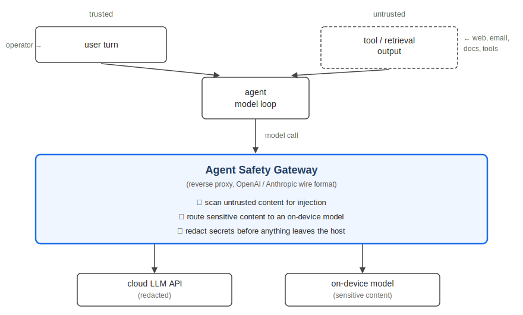
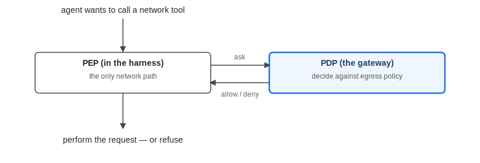

# Mind Your Prompts and Tools

*A proxy can guard one, not the other.*

---

In June 2025, researchers at Aim Security disclosed [EchoLeak](https://www.catonetworks.com/blog/breaking-down-echoleak/) (CVE-2025-32711). A malicious instruction embedded in an email reached Copilot through its retrieval pipeline. Without any action from the recipient, the agent read the email, read the embedded instruction, and exfiltrated internal data to an external server — the first documented zero-click exfiltration via prompt injection in a production AI system. Microsoft's own classifier didn't catch it on the way in.

I built a reverse proxy that sits between an agent and the model it calls to scan for injected instructions like EchoLeak's — instructions buried in the content an agent reads — before they reach the model. On the kind of buried, indirect injection EchoLeak used, a standard injection classifier caught just 31%; the guard I built caught 98.6% with its default local model (89% even on a weaker alternative). But catching what the agent *reads* doesn't touch what it then *does* — and an agent's actions happen off the model wire, where a proxy can't see them. Closing that gap meant moving enforcement off the wire entirely.

---

## The problem: an agent can't tell your instructions from the ones it reads

To get anything done, an agent reads from places its operator doesn't control: web pages, emails, retrieved documents, the output of the tools it calls. Any of that untrusted input can be written to look like a command.

The model has no reliable way to tell the difference. By the time content reaches the context window, an instruction you typed and an instruction buried in a fetched document look identical, and the agent often acts on both. That's prompt injection, and it's a property of how agents consume input.

**The one durable signal is the channel the text arrived on** — your turn versus a tool result — and that signal is visible on the wire, not inside the model.

---

## Where the gateway sits

The gateway is a transparent proxy for the OpenAI and Anthropic APIs. Point an agent's base URL at it and it intercepts every model call, without any changes to the agent or model. I ran it in front of a general assistant I use daily: email, web, messaging — the classic injection surface.

It scans the untrusted channel, the tool and retrieval output the model can't separate from your instructions, and **not your own turn**: the threat model treats the operator as trusted by design.

It also does two things with the content it routes: it sends material the scanner marks sensitive to an on-device model instead of the cloud, so sensitive data never leaves the host, and it redacts secrets from anything that does go out. That same sensitivity signal returns later as the deciding factor at the egress gate.

---

## The recall win

The default inbound scanner is a DeBERTa classifier fine-tuned for injection detection. It does well on *overt* attacks — payloads that say "ignore previous instructions" outright — because those carry the surface form it was trained to match. It does much worse on indirect ones. The garak `latentinjection` probes hide their instruction inside an ordinary-looking document the model is processing, and the classifier caught only 31% of those. It misses them because it matches the *surface form* of an injection, and an instruction buried in plain content doesn't have that form.

This isn't a context-length limit. The scanner already splits long inputs into overlapping 512-token windows and scores each, so a payload can't hide just by sitting deep in the text — the probes it missed were short enough to fit one window, and it caught the longest probe most often. The blind spot is structural: surface-form matching, not input length.

So I added a guard backed by a local LLM that reasons over the content instead of matching its surface form.

**On these indirect attacks, recall went from 31% to 98.6%** — the guard's default model on the same garak `latentinjection` probes. A weaker alternative model reached 89% on the same set, so the gain holds across models rather than riding on one. This isn't simply "a bigger model wins": DeBERTa is the **standard, always-on default** for injection detection, and it fails here *structurally* — surface-form matching can't see an instruction that has no injection-like surface form, regardless of model size.

Recall is the fraction of real attacks the scanner caught. Computing it requires knowing how many attacks were missed. With garak's published `latentinjection` probes, every item is a known attack by construction — so every miss is counted, and recall follows directly.

These figures are recall on injected *instructions* — and specifically the indirect, buried kind these probes test. An attack that instead steers what the agent *does*, without ever planting an instruction to detect, is a separate and harder problem this number doesn't measure. A scanner on the wire can narrow the injection gap; closing the action gap means governing what the agent does, not just what it reads.

---

## Beyond the model wire

A proxy on the model wire sees everything the model reads and says. Pointing a real coding agent at the gateway showed me the limit.

The gateway hard-blocked a poisoned tool result on the way in — a 400, before the model ever saw it. That worked as designed. But a wire proxy can only act on what the model reads, and **what the agent *does* is a different surface.** Tool execution is client-side: when an agent runs a shell command or calls an HTTP tool, it happens in its own harness, off the model wire. A proxy there can police what the model *reads* and *says*. It cannot police what the agent *does*.

This is structural, not something I could tune away: a control can only act on what it can see, and the action isn't visible from the model wire.

So I stopped trying to enforce actions from the wire and **split the decision from the enforcement** — the PDP/PEP pattern from access control:

The gateway became the **Policy Decision Point**: an endpoint that evaluates an outbound request against destination allowlists and the sensitivity of its payload. Enforcement moved to a **Policy Enforcement Point** inside the agent's harness — a gated egress tool, set up as the agent's only network path. It asks the PDP before every call.

I drove a real agent to POST a secret-bearing config file to a host that wasn't allowlisted. The tool consulted the PDP, and the PDP **denied it** — 403, `sensitivity=secret`, nothing left the machine.

No scanner could have stood in for the gate here. There was no injected instruction to detect: nothing malicious arrived in what the agent *read*. The secret left in what the agent *did* — an outbound request the scanner never inspects.

---

## What it costs, and where I'd put it

Three tiers of added latency:

- **Proxy overhead — 1–2 ms** (always paid). The gateway's own work — parse, inject-scan, spend check, SSE tee, fire-and-forget audit — adds a millisecond or two at the tail (server-side, against a deterministic mock upstream); responses stream straight through, so the proxy is never the bottleneck. ([full benchmark](benchmarks.md))
- **DeBERTa scan — ~40 ms** per scanned item. The default guard, run inline on every tool result; cheap enough to stay on the request path.
- **Local-LLM guard — ~1.4 s p50, ~1.6 s p95** per untrusted item (~3.6 s on a cold model load). This is the opt-in recall win.

What makes 1.4 s acceptable in the live path is *scoping*, not speed: the LLM guard fires only on tool-using turns — the untrusted channel — so ordinary user↔assistant turns pay nothing, and the cost lands only where the injection threat lives. At that scoping, inline-blocking on tool turns is viable, and that's the deployment shape I'd recommend.

---

## Limitations

- **This is cooperative enforcement, not containment.** The PEP gates the egress tool and hard-blocks it — for an agent that stays on that path, including one misled by an injection but still running its normal harness. It doesn't take a maliciously rewritten client to get around it: denied its first request, a persistent agent keeps problem-solving and reaches an ungated path on its own. The gate holds for an agent that asks; it isn't a sandbox.
- **Shellout is the easy ungated path.** `sh -c 'curl …'` clears a `curl` block because the first token is `sh`; `python3` isn't gated at all. Closing that means gating those surfaces too — or, for true containment, OS-level network sandboxing, a different problem and out of scope here.
- **It's a single-user deployment, not production.** "Zero false positives on the traffic it scans" means one person's real traffic, not a fleet blocking multi-tenant production.

---

## How I measured this

The gateway is built in Python/FastAPI; the local models run on-device via [oMLX](https://github.com/jundot/omlx). Recall is an offline garak run on the independent `latentinjection` probes (n=72): 98.6% (71/72) with the guard's default local model, 89% (64/72) with a weaker alternative, versus 31% for DeBERTa. The local-LLM guard is opt-in; the always-on default stays the fast DeBERTa scanner — so this recall is what the guard achieves when enabled, not what blocks every request by default.

The only live measurement is the false-positive rate, and it's pinned to the channel the guard actually reads: 0/109 on the scanned tool/retrieval channel. Not scanning your own turn is more than a trust-model choice. Running the same guard over the user channel as a check, it over-fired on ~16% of honest turns (7/44; model-dependent, small sample). Scoping to the untrusted channel measurably avoids those false positives.

---

## Conclusion

Both results came from the same realization: each control was blind to something structural, and fixing it meant changing the control rather than tuning it. Swapping the surface-pattern classifier for a guard that reasons over the content raised indirect-injection recall from 31% to 98.6% (89% even on a weaker model). And no control on the model wire could govern what the agent did, because tool execution happens off the wire — so enforcement had to move into a policy point the agent calls before it acts.

The egress gate covers HTTP calls today; the same split extends to bash and subprocess, each one narrowing the gap between what the agent can do and what the gateway can see. On the next system, the first thing I'd map is where a control can actually sit, and what stays outside its view.

---

*The code is a curated public extract: the gateway, the adversarial-eval harness, and the test suite. The eval corpus is full of secret-shaped strings (`sk-…` and friends) on purpose — they're synthetic fixtures for the redaction tests, marked as such, no real credential ever in version control.*

*Repository: [github.com/ccordi/agentgate](https://github.com/ccordi/agentgate) · Setup: [Integration guide](integration.md)*
