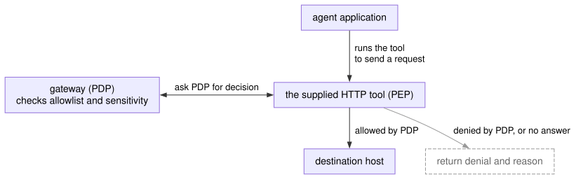

# Mind Your Prompts and Tools

[EchoLeak](https://www.catonetworks.com/blog/breaking-down-echoleak/), a vulnerability found by
Aim Security, showed how a malicious email could make Microsoft 365 Copilot expose private
data without the recipient clicking a link. The email contained instructions that the
model followed while processing retrieved content.

I built agentgate to explore how much protection a gateway between an agent and
its model could provide. An agent works in a loop: the agent application sends the
conversation to a model, and the model replies with an answer or a request to use a
tool, such as reading an email or sending an HTTP request. The application runs the
tool, adds the result to the conversation and sends it to the model again.

A gateway on that connection reads every request before the model does, including
the tool results the application just added. That makes it a good place to catch
injected instructions. It never sees the tools run, though: when a tool sends data
somewhere, the traffic goes straight from the application to its destination.
Stopping that needed a check inside the tool itself.

## How the gateway works

agentgate is a reverse proxy for the OpenAI Chat Completions API. Point an agent
application's base URL at it to send model requests through the gateway. I used
it with a personal assistant that reads email, browses the web and sends messages.

The gateway can send each request to a local model or to a cloud provider. By
default, requests with detected secrets or personal data go to the local model.
Redaction masks detected secrets and personal data in requests sent to a cloud
provider. Both depend on what the sensitivity checks detect; missed detections can
still expose data.

Responses stream back through the gateway. It also records requests in an audit
log and caps each client's estimated spending.

## Scanning for prompt injection

To complete a task, an agent reads web pages, emails and documents through its
tools. An attacker can put instructions in any of that content and try to make the
agent follow them. A model may treat those instructions as part of its task, even though
they came from a document rather than the operator. This is prompt injection.

Each message in a request carries a role, a label the agent application sets, such
as `user` or `tool`. The gateway uses those labels to find the new tool results and
scans them before forwarding the request. I tried two scanners: the classifier, a model trained to score
text for prompt injection, and the LLM judge, a local language model asked whether a tool
result contains injected instructions.

## Detection results

I tested both scanners with garak, an open-source tool for testing language models
against known attacks. Its `latentinjection` attacks hide instructions inside
ordinary-looking documents. The LLM judge used Google's Gemma 4 26B model, running
locally. Both scanners also checked anonymized, benign traffic from an agent.

| Scanner | Attacks caught | Benign tool results flagged |
| --- | --- | --- |
| Classifier | 31 of 72 (43%) | 12 of 109 |
| LLM judge (Gemma) | 72 of 72 (100%) | 0 of 109 |

The LLM judge caught every attack and flagged no benign tool result, while the
classifier missed most attacks. The LLM judge's cost is time, as the next section shows.

The [results page](results.md#scanner-accuracy) also covers a second model, encoded
attacks, and benign text that discusses attacks.

## Latency

Without the classifier or the LLM judge, the gateway's own processing takes
about 1 ms or less for 95% of requests. Scanning adds more:

| Scanner | Median added time |
| --- | --- |
| Classifier | About 30 ms per request |
| LLM judge (Gemma) | About 1.5 s per tool result |

The [results page](results.md#latency) gives the full distributions.

The LLM judge runs only when a request carries new tool results, so other turns
don't wait for it. When it does run, the delay comes before the request reaches
the model; the response then streams back without further delay.

## Checking HTTP requests made by tools

A common goal of injected instructions, as in EchoLeak, is to make the agent send
private data somewhere. The gateway does see the model's tool calls, but a call
doesn't always contain what the tool will send: a shell command can name a file
that is read only when the command runs. So the check happens in the tool, just
before it sends.

agentgate includes an HTTP tool that asks the gateway to check each
request before sending it. The gateway blocks sensitive data bound for an external
destination that isn't on an allowlist, whether or not an injection was detected.
If the gateway denies the request or can't be reached, the tool does not access the
requested host; it returns the denial and reason to the agent.

The gateway makes the decision and the tool enforces it. In access control, these
are called the policy decision point (PDP) and the policy enforcement point (PEP):

This protection applies only when the agent uses the supplied tool. The
[setup for OpenCode](opencode.md#http-requests-made-by-tools), an open-source coding
agent, turns off its built-in fetch and search tools and blocks direct `curl`, `wget` and `fetch`
commands. A command wrapped in a shell, or a Python script, can still make
unchecked requests.

## Limits

The LLM judge caught every attack in this test, but other attacks may get through.
The classifier misses many attacks and blocks some benign content.

The gateway relies on the agent application to label messages correctly and to
make HTTP requests through the supplied tool. It does not sandbox the application
or control its access to files, processes and networks. The
[threat model](threat-model.md) describes these assumptions and the limits of
routing, redaction, spending controls and audit storage.

## Trying it

[Getting started](getting-started.md) runs the gateway with a mock model server and
the built-in heuristic scanner, which matches known attack phrases. The heuristic
scanner should only be used to try the gateway out, as it misses many attacks. The
[configuration guide](configuration.md#scanner-backends) explains how to set up the
classifier or the LLM judge as the gateway's scanner instead.
