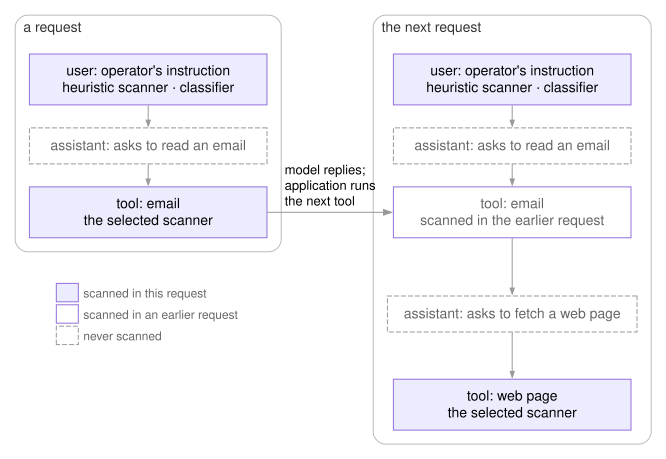

# Threat model

agentgate checks model requests sent through the gateway and HTTP requests made
by the supplied HTTP tool. It does not secure the host or sandbox the agent
application. This page describes what those checks protect, what they rely on,
and how they can fail.

The intended deployment has a single operator and a single host, with the gateway
reachable only through the host's loopback interface.

## Assets

- **Private data:** credentials, emails, configuration files and other content the
  agent can read, including API keys used to access model providers.
- **The operator's task:** instructions and constraints that external content might
  try to override.
- **Access to tools and model resources:** permission to read files, run commands,
  make network requests and spend money on model calls.

## Attack vectors

The attacker can't instruct the agent directly. Instead, they supply content the
agent reads through its tools, such as web pages, emails and documents, and try to
make the agent follow instructions hidden in it.

The agent application sends each tool's description to the model with every
request, and an attacker can sometimes control that text, for example when it comes
from a remote MCP (Model Context Protocol) server, a service that supplies tools to the
agent.

A web page open in the operator's browser can also send requests to the gateway,
because browsers can reach services on the local machine.

## Assumptions

- **The agent application labels messages correctly.** Each scanner chooses what to
  check by message role. Outside content labeled as a user message is not checked by
  the LLM judge.
- **Tools that send data use the supplied HTTP tool.** Other tools, shell commands and
  scripts don't ask the gateway.
- **Cloud providers can be trusted with what they receive.** Routing and redaction
  reduce what is sent to a cloud provider; they don't control what the provider does
  with it.
- **The attacker cannot modify the agent application or the gateway**, or intercept
  local traffic between the application, gateway and model.

## Threats and mitigations

### Unwanted requests to the gateway

The gateway refuses to start unless it listens on a loopback address. In the
supplied Docker setup, `AGENTGATE_CONTAINER_BIND` lets it listen on other addresses
inside its container while Compose publishes the port only on the host's loopback
interface; the gateway can't check that arrangement. Using this setting on a bare
host, or starting the gateway's web server (Uvicorn) directly with another
`--host`, bypasses the check.

The admin API requires `AGENTGATE_ADMIN_TOKEN`, and the HTTP tool's policy checks
require `AGENTGATE_PDP_TOKEN`. Both tokens must be set, with different values,
before the gateway starts. A `Host` header check also limits DNS rebinding, where
an attacker's domain is made to point at the local gateway. A remote caller that
can reach the gateway can forge that header, so the check doesn't replace network
restrictions.

Model requests don't need a gateway-issued key by default, so a web page can still send
requests that use the local model, even though the browser can't read the
responses. Setting `AGENTGATE_REQUIRE_ISSUED_KEYS=true` requires a gateway-issued
key on every model request; [credentials](configuration.md#credentials) explains
what that changes.

### Prompt injection in tool results

A fetched email or web page may contain instructions meant to redirect the
agent. Before forwarding a request, the gateway scans the newest tool results
the model hasn't answered yet. The built-in heuristic scanner and the classifier also scan the newest
user message; they are cheap enough to run on everything. The LLM judge scans only
tool results: each scan is a call to a language model, and it can flag benign user
messages far more often than the classifier, so it is kept off the user message. The
user message is normally the operator's own instruction, but it can also carry outside
content, such as a file attached to the prompt or text pasted from an email. Content
arriving that way is checked only by the heuristic scanner and the classifier, which
catch fewer attacks than the LLM judge; with the LLM judge alone, it is not scanned at all.

Two consecutive requests from one conversation, in which the model reads an
email and then fetches a web page:

When a scanner blocks, the gateway rejects the request with HTTP 400 before it
reaches the model. With the heuristic scanner, content that looks suspicious but
scores below the blocking threshold is recorded in the audit log and allowed
through; the classifier and the LLM judge either block or allow.

The scan has limits:

- Scanners can miss injected instructions and flag benign content; the
  [results](results.md#scanner-accuracy) give each scanner's rates.
- The classifier reads at most about 26,000 characters of each message
  it scans; the rest isn't scanned. The LLM judge sends each tool result whole,
  so one longer than its model's context window either fails the scan, which
  rejects the request, or is cut short by the model server.
- Tool results the model has already answered, and the model's own earlier
  replies, are not scanned again. This saves time and avoids repeat false
  alarms, but leaves earlier content outside the scan.

### Prompt injection in tool descriptions

A tool's description is written for the model, and the agent application sends
it with every request. A malicious tool can hide instructions there.
[Invariant Labs showed this](https://invariantlabs.ai/blog/mcp-security-notification-tool-poisoning-attacks)
in April 2025 with an `add` tool from an MCP server whose description told the
model to read the operator's MCP configuration and SSH private key, pass them in
a spare parameter, and keep quiet about it. Cursor's agent did as told.

The gateway checks every tool definition in a request for phrases that give
orders rather than describe the tool, such as "ignore previous instructions",
"do not mention" or "exfiltrate". It reads the tool's description and the
descriptions and allowed values in its parameter schema, and rejects the request
with HTTP 400 on a match. Because tool definitions arrive with every request, a
description that changes after the operator first approved the tool is checked
again. Suspicious names such as `exec` or `curl`, descriptions that promise to
do anything, and empty descriptions are recorded in the audit log but don't
block.

The check reads what a description says, not what a tool's code does, and it
matches fixed phrases. The demonstration above is caught by its "do not mention"
line; the same instructions without that line would pass. A tool with an
ordinary description and malicious code passes too:
[a package published in September 2025](https://thehackernews.com/2025/09/first-malicious-mcp-server-found.html)
was a copy of a real email-sending tool with one added line that copied every
email to its publisher.

### Sensitive data sent to a cloud model

The agent's conversation can carry credentials, personal data and private code,
and a request sent to a cloud provider takes all of it off the machine.

Each request's conversation is checked for sensitive content with fixed patterns:
private keys, API keys and tokens of common shapes, password assignments, long
high-entropy strings, email addresses, phone numbers, and card and social security
numbers.
Sensitivity routing is on by default, and a request with a match goes to the
local model. Both routes point at the local model until the operator names a
cloud provider, so a fresh install sends nothing off the machine. A request that
does go to a cloud provider has each detected item replaced with a label such as
`[REDACTED:email]` before sending, in message content and tool-call arguments
alike. [Providers and models](configuration.md#providers-and-models) covers the
routing settings.

These patterns detect only sensitive data with an easily matched shape. Data in an
unknown shape, or with no fixed shape at all, such as a person's name, passes
undetected.

The routing check runs on every request, and every request carries the whole
conversation so far. To keep the check fast, it reads only the first 20,000
characters of that conversation, which an agent session can pass within a few
turns. From then on, sensitive content in newer turns does not change the route.
The redaction step is quick and always applies to the entire conversation, so
sensitive data detected via the pattern matcher is still redacted before a cloud
request is sent.

### Sensitive data sent through HTTP tools

Injected instructions often aim to make the agent send private data to an attacker,
such as by posting a file to a website the attacker controls.

The supplied HTTP tool asks the gateway for a decision before each request and
only attempts the request if the gateway allows it. The gateway allows any
request to a destination on the operator's allowlist or on the local machine,
except to the gateway's own address, which must be allowlisted explicitly. For
any other destination, it checks the request's address, header values and body with
the same patterns as the routing check above and denies the request on a match. The
[write-up](index.md#checking-http-requests-made-by-tools) explains the design,
and the [OpenCode guide](opencode.md#http-requests-made-by-tools) shows the
setup.

The check covers only requests made through that tool, as noted under
Assumptions. It reads only the first 1,000,000 characters of a request, so
anything after that point is not checked. It also inherits the pattern matching's
limits: sensitive data that no pattern matches leaves freely, and a destination on
the allowlist receives anything.

### Runaway spending

An agent stuck in a loop, or one steered by injected instructions, can call a
paid model over and over.

The gateway estimates the cost of each cloud request from its reported token
counts and adds it to a per-key total for a fixed window that starts with the
key's first request. When the total reaches the key's
[spending cap](configuration.md#spending), the gateway trips a kill switch: every
further request on that key gets HTTP 429 until the operator clears the switch
through the admin API. Local models have no per-request
price, so the gateway counts their requests against a separate cap instead. Responses from models
without a price entry, or that are cut short before their final token counts
arrive, are counted as zero cost and add nothing to the total. The
[audit guide](audit.md#cost-estimates) explains how costs are estimated.

### Sensitive data in audit storage

The gateway keeps a record of the requests it handles on disk;
[missing records](audit.md#missing-records) lists the exceptions. Each record is a
metadata row: time, an identifier derived from the client's credential, the model and
provider, the sensitivity class, scanner scores and flags, token counts and
cost. These rows are kept indefinitely and are not encrypted, so anyone who can
read the database file can read them. Message content is stored only when the
operator sets an [encryption key](configuration.md#audit-storage), and never for
requests sent to a local model or classified as sensitive; the Configuration page
lists which other requests are saved and for how long. What is stored is the
scanned content, the newest tool results and user message, redacted and then
encrypted. The [audit guide](audit.md#saved-content) explains how to read it.

### Scanner unavailable

The gateway fails closed if a scanner can't run. If the classifier's
model can't load, the gateway doesn't start. If a scan fails during a request,
most likely because the LLM judge's model server is down or too slow, the
gateway rejects the request with HTTP 503 and forwards nothing.

## Out of scope

- **The host and the agent application.** The gateway does not restrict what the
  agent reads, runs, or sends through tools other than the supplied one.
  Restricting arbitrary tool calls would require operating system controls, such
  as a sandbox or firewall rules, which neither the gateway nor its Docker setup
  provides.
- **More than one operator.** Keys and limits are per client, but the audit
  database, the admin token and the settings are shared, so the gateway does not
  separate one person's data or control from another's.

## Results and implementation

The [write-up](index.md) explains the design, and the [Results](results.md) page gives
the measurements.

The main request checks are in [`pipeline.py`](https://github.com/ccordi/agentgate/blob/main/src/agentgate/pipeline.py).
The HTTP policy is in [`egress/policy.py`](https://github.com/ccordi/agentgate/blob/main/src/agentgate/egress/policy.py), and
[`egress/pep.py`](https://github.com/ccordi/agentgate/blob/main/src/agentgate/egress/pep.py) implements the tool's check before
sending a request.
